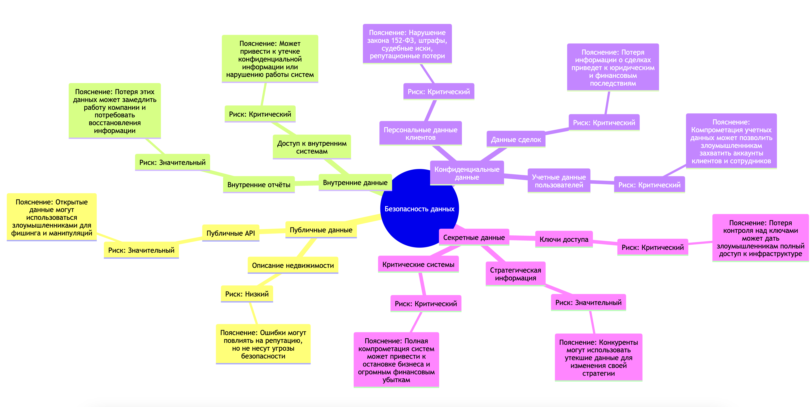

# **Проверочный лист по безопасности данных приложения PropDevelopment - сервис по покупке недвижимости и обслуживанию жилых комплексов**

## 1. **Классификация данных PropDevelopment по стандартам ISO/IEC 27001 и 27002**

## **1.1. Публичные данные (Public Data)**
Эти данные доступны широкому кругу лиц и не представляют угрозы для безопасности, если становятся известны.

### **Примеры в PropDevelopment:**
- Описание жилых комплексов и квартир в онлайн-витрине.
- Общая информация о компании (история, достижения, партнёрства).
- Публичные API-документации для интеграции партнёров (без чувствительных данных).
- Маркетинговые материалы и новости компании.

---

## **1.2. Внутренние данные (Internal Data)**
Эти данные предназначены для использования внутри компании и не должны передаваться за её пределы. Их раскрытие может привести к небольшим или средним репутационным и финансовым рискам.

### **Примеры в PropDevelopment:**
- Внутренние бизнес-процессы и процедуры.
- Данные о клиентских заявках (без личной информации).
- Внутренние отчёты и аналитика по продажам.
- Информация о разработке IT-продуктов (архитектура, код, интеграции).
- Данные мониторинга IT-систем и инфраструктуры.
- Внутренние API, не предназначенные для партнёров.

---

## **1.3. Конфиденциальные данные (Confidential Data)**
Эти данные могут нанести серьёзный ущерб компании или клиентам при утечке. Они требуют защиты от несанкционированного доступа.

### **Примеры в PropDevelopment:**
- Персональные данные клиентов и собственников (ФИО, телефон, email, паспортные данные).
- История бронирования и сделок клиентов.
- Финансовые транзакции клиентов, включая оплату ЖКХ.
- Данные о партнёрских договорах и условиях сотрудничества.
- Логины и пароли пользователей (в хешированном виде).
- Данные API-интеграций с госорганами (например, Росреестр).
- Внутренние учётные записи сотрудников и логирование действий.

---

## **1.4. Секретные данные (Secret Data)**
Эти данные обладают критической важностью для бизнеса, и их компрометация может привести к катастрофическим последствиям (например, штрафам, судебным искам, кибератакам, полной остановке бизнеса).

### **Примеры в PropDevelopment:**
- Доступы к инфраструктуре (ключи, токены, SSH-доступы к серверам).
- Ключи шифрования баз данных.
- Данные для аутентификации в системах госорганов.
- Полные финансовые отчёты и стратегические планы компании.
- Логика принятия решений в AI/ML-системах, обрабатывающих клиентские данные.
- Неофициальные записи о юридических аспектах сделок.

---

## **2 и 4. Анализ рисков по категориям данных**

| Категория данных        | Потенциальные риски       | Оценка риска (Низкий/Значительный/Критический) | Причины оценки | Как нужно защищать эти данные |
|-------------------------|--------------------------|--------------------------------------------------------|----------------|----------------------------------|
| **Публичные данные**    | Утечка данных           | Низкий                                                 | Эти данные доступны для широкой аудитории и не несут угрозы безопасности. | Контроль публикаций, защита от несанкционированного редактирования. |
|                         | Использование мошенниками | Значительный                                                | Данные могут быть использованы для фишинговых атак или манипуляций. | Ограничение API-запросов, мониторинг активности, антибот-защита. |
| **Внутренние данные**   | Потеря данных           | Значительный                                                | Внутренние отчёты и техническая документация важны для работы компании, их потеря может замедлить процессы. | Резервное копирование, контроль доступа, аудит изменений. |
|                         | Неконтролируемый доступ  | Значительный                                                | Доступ без ограничений может привести к несанкционированным изменениям. | Ограничение прав доступа, двухфакторная аутентификация (2FA). |
| **Конфиденциальные данные** | Утечка персональных данных | Критический                                            | Содержит ФИО, паспортные данные, контактную информацию клиентов. | Шифрование, контроль доступа, мониторинг утечек. |
|                         | Потеря данных            | Критический                                            | Критично для бизнеса, потеря может привести к юридическим последствиям. | Автоматическое резервное копирование, защита от удаления. |
|                         | Несанкционированный доступ | Критический                                            | Хранение логинов, паролей и API-ключей требует строгих мер защиты. | Менеджеры паролей, ротация ключей, строгие политики паролей. |
| **Секретные данные**    | Компрометация ключей доступа | Критический                                            | Утечка ключей шифрования может привести к полному взлому инфраструктуры. | Аппаратные модули безопасности (HSM), строгая изоляция секретов. |
|                         | Утечка стратегической информации | Значительный                                                | Может привести к конкурентным потерям и финансовым убыткам. | Ограниченный доступ по принципу минимальных привилегий. |
|                         | Несанкционированный доступ | Критический                                            | Полный контроль над критическими системами может привести к остановке бизнеса. | Сегментация сети, детальный аудит доступа. |

## 3. **Анализ рисков и защита данных PropDevelopment - меры защиты**

## **Общие меры по защите данных в PropDevelopment**

### **1. Управление доступом**
- Принцип **минимально необходимого доступа** (Least Privilege) – каждый пользователь получает доступ только к тем данным, которые необходимы для его работы.
- Внедрение **многофакторной аутентификации (MFA/2FA)** для защиты учетных записей сотрудников.
- Регулярный аудит учетных записей и уровней доступа, своевременное удаление неактивных пользователей.

---

### **2. Шифрование данных**
- **Шифрование хранимых данных** (Data-at-Rest) для защиты конфиденциальной информации в базах данных.
- **Шифрование передаваемых данных** (Data-in-Transit) с использованием TLS/SSL.
- Безопасное управление **ключами шифрования** с использованием аппаратных модулей безопасности (HSM).

---

### **3. Мониторинг и аудит**
- Логирование всех критически важных операций и событий безопасности.
- Настройка **системы обнаружения вторжений (IDS/IPS)** для выявления подозрительной активности.
- Регулярное проведение **аудитов безопасности**, включая тестирование на проникновение (penetration testing).

---

### **4. Резервное копирование и восстановление**
- Автоматическое **резервное копирование** всех критически важных данных с регулярным тестированием восстановления.
- Использование **географически распределенных резервных копий** для защиты от отказов инфраструктуры.

---

### **5. Защита API и интеграций**
- Внедрение **OAuth 2.0 и JWT** для аутентификации API-запросов.
- Ограничение количества API-запросов (**rate limiting**) для защиты от DDoS-атак.
- Мониторинг и аудит всех сторонних интеграций на предмет утечки данных.

---

### **6. Повышение осведомленности сотрудников**
- Регулярное обучение сотрудников **методам защиты информации** и выявлению фишинговых атак.
- Разработка и распространение **внутренних политик безопасности** и контроль их выполнения.
- Проведение тестов на **социальную инженерную устойчивость**.

---

### **7. Реакция на инциденты**
- Наличие плана реагирования на инциденты **(Incident Response Plan)** с четкими инструкциями по действиям в случае утечки данных.
- Оперативное уведомление заинтересованных сторон при инцидентах.
- Анализ инцидентов и обновление политики безопасности после выявленных уязвимостей.

---

Эти меры позволят **минимизировать риски утечек, потерь и компрометации данных** в PropDevelopment, обеспечивая надежную защиту клиентской и корпоративной информации.

## **Общие меры по защите данных в PropDevelopment - углубленно по каждому типу**

## **3.1. Публичные данные**
### **Риски:**
- **Утечка данных** – некорректная информация может негативно повлиять на репутацию компании.
- **Использование мошенниками** – злоумышленники могут использовать открытые данные для фишинга или подделки предложений.

### **Как защищать:**
- Контроль публикаций, защита от несанкционированного редактирования.
- Ограничение API-запросов, мониторинг активности, антибот-защита.

---

## **3.2. Внутренние данные**
### **Риски:**
- **Потеря данных** – может привести к дезорганизации работы команды и необходимости восстановления данных.
- **Неконтролируемый доступ** – несанкционированные изменения могут нарушить работу систем.

### **Как защищать:**
- Регулярное резервное копирование.
- Контроль доступа и аудит изменений.
- Ограничение прав пользователей, использование 2FA.

---

## **3.3. Конфиденциальные данные**
### **Риски:**
- **Утечка персональных данных** – нарушение законодательства (152-ФЗ), репутационные и финансовые риски.
- **Потеря данных** – может привести к невозможности восстановления информации клиентов.
- **Несанкционированный доступ** – компрометация учетных данных может позволить злоумышленникам получить доступ к аккаунтам пользователей.

### **Как защищать:**
- Шифрование данных, строгий контроль доступа.
- Мониторинг утечек, автоматическое резервное копирование.
- Менеджеры паролей, ротация ключей, строгие политики паролей.

---

## **3.4. Секретные данные**
### **Риски:**
- **Компрометация ключей доступа** – злоумышленники могут получить полный контроль над инфраструктурой.
- **Утечка стратегической информации** – конкуренты могут использовать данные для изменения своих стратегий.
- **Несанкционированный доступ** – может привести к полному параличу бизнеса.

### **Как защищать:**
- Использование аппаратных модулей безопасности (HSM).
- Изоляция секретов, ограниченный доступ по принципу минимальных привилегий.
- Сегментация сети, детальный аудит доступа.

--

## 5. **Визуализация результатов в виде mindmap диаграммы**

ниже на схеме

