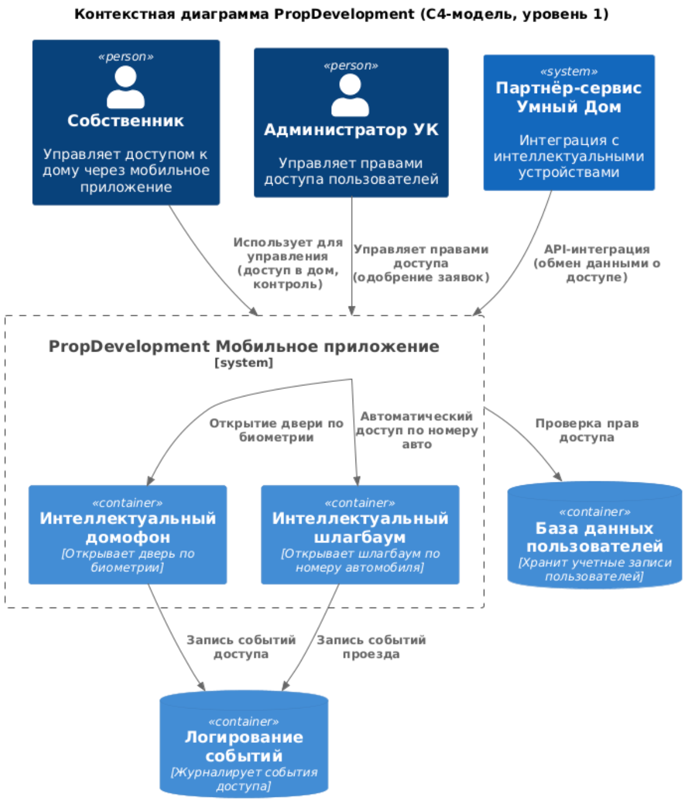

Диаграмма контеста ниже

# **Требования к внешним интеграциям**

Внешние интеграции в рамках проекта PropDevelopment должны соответствовать следующим требованиям.

## **1. Требования к безопасности**
- Вся передача данных между системами должна осуществляться с использованием **TLS 1.2/1.3**.
- Данные клиентов и учетные записи пользователей должны **шифроваться** при хранении (AES-256) и передаче.
- Необходимо внедрение **контроля доступа** на уровне API (роль/права).
- Обязательно ведение **журналирования всех запросов** к API-интеграциям.
- Ограничение **доступа по IP-адресам** для партнерских сервисов.
- Реализация механизмов **rate limiting** и защиты от DDoS-атак.

## **2. Протоколы аутентификации и авторизации**
- Все API-интеграции должны использовать **OAuth 2.0/OpenID Connect** для аутентификации.
- Авторизация запросов должна выполняться с применением **JWT (JSON Web Tokens)** с коротким временем жизни.
- Для защиты административного доступа должна быть включена **многофакторная аутентификация (2FA)**.
- Внешние сервисы должны использовать **PKI (инфраструктуру открытых ключей)** для проверки подлинности API-запросов.

## **3. Организация взаимодействия между системами (технологии, протоколы и т. п.)**
- Взаимодействие между системами должно быть **событийно-ориентированным (Event-driven)** с возможностью **pub/sub** для обновления данных в реальном времени.
- API должны предоставлять интерфейсы **REST (JSON) или gRPC**, в зависимости от сценария использования.
- Взаимодействие с системами ЖКХ и умными устройствами должно выполняться через **шлюз API (API Gateway)**.
- Все API-интеграции должны быть **документированы** с использованием **OpenAPI (Swagger)**.

## **4. Организация взаимодействия между системами (интеграции и функциональный уровень)**

### **4.1. Взаимодействие с мобильным приложением**
- **Мобильное приложение** отправляет запросы на сервер PropDevelopment.
- **Сервер взаимодействует с API партнера** и возвращает ответ пользователю.
- Вся логика обработки доступа выполняется **на стороне PropDevelopment**.

### **4.2. Обмен данными с интеллектуальным домофоном и шлагбаумом**
- **Сервер PropDevelopment отправляет запрос** на сервер партнера через API.
- **Партнер подтверждает разрешение** и отправляет команду на устройство.
- **Данные о входе/выходе регистрируются** в PropDevelopment для аудита.

### **4.3. Интеграция в существующую архитектуру**
- **Добавление новых микросервисов** для управления устройствами.
- **Логирование всех действий** пользователей в централизованном хранилище логов.
- **Система уведомлений в мобильном приложении** при срабатывании автоматического доступа.

---

## **5. Мониторинг и отказоустойчивость**
- API-интеграции должны поддерживать **Circuit Breaker** для предотвращения каскадных сбоев.
- Использование **логирования** и **трассировки запросов** (например, ELK, Prometheus, OpenTelemetry).
- Обеспечение резервирования и дублирования критически важных сервисов.
- Внедрение SLA/SLO для определения метрик доступности интеграций.

---

Эти требования обеспечат безопасное и эффективное взаимодействие между системами PropDevelopment и внешними платформами.